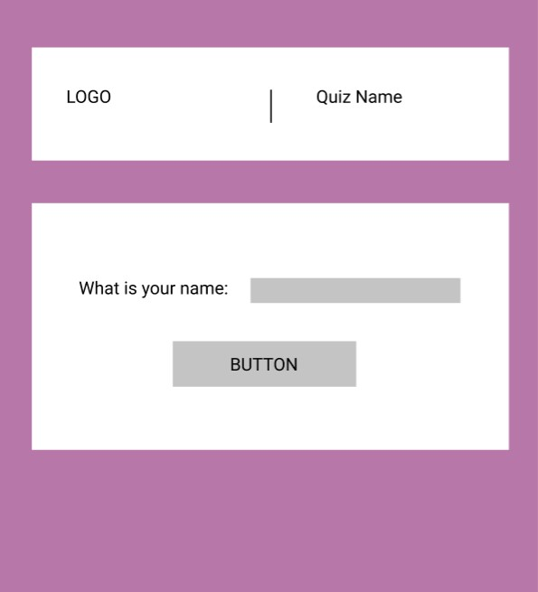

# Phrasal Verbs Quiz

## Screenshots

### Desktop

### Tablet

### Mobile

## Project Overview

Skye Online English (https://www.skyeonlineenglish.com/) is an online English-langauge teaching website which is owned by the developer of this project. 

This quiz is intended to be used by students who are studying English as a second language with a focus on phrasal verbs containing the preposition 'DOWN'.

When students are learning new language, it is important for them to consolidate their knowledge by doing contextualised exercises - prior to using the langauge in 'free' exercises - such as open discussions.  This is designed for the self-study student to be introduced to, and be given the opportunity to consolidate phrasal verbs with 'down' befoore attempting to use them freely.

It follows the standard EFL teaching method of 'Present, Practise, Produce (PPP)', with the target langauge being presented int he form of a written language description, and then parctised in a quiz format.  Production would then take place in a classroom or social environemnt.

## User Experience (UX)
 
### User Stories
* First Time Visitor
    * As a user, I want to easily understand what the page is about.
    * As a user, I want to be able to navigate through the quiz as easily as possible.
* Returning Visitor
    * As a user, I want to be able to redo the quiz to check my understanding after I check the answers easily.
* Frequent Visitor
    * This is not going to be visited frequently, however the template may be duplicated for frequent users to be comfortable doing other quizes using the same format.

### Design
* Colour Scheme
    * The parent website [Skye Online English](https://www.skyeonlineenglish.com/) uses a limited number of colours with the main background colour being grey.  It was chosen to give it a more professional / corporate feel.  The quiz is designed to be more enjoyable but remaining within the confines of the parent site's colour scheme.  Therefore three principle colours were chosen:
        * Background: #b877a9 - rgb(184,119,169) - Purple - used in Skye Online English's logo
        * Key Text: #0cad95 - rgb(12,173,149) - Green - used in Skye Online English's logo
        * Text Backgrounds: #ffffff - rgb(255, 255, 255) - white

* Typography
    * The 'Lato' and 'Source Sans Pro' fonts (from Google Fonts) were used as a tthe main fonts throughout as they are both clean and easy to read.
    * Key langauge (including the quiz title) color:  #0cad95 - rgb(12,173,149) - Green
        * I felt that this color stood out against the background and kept within the color scheme of the company's branding.
    * Error message color: #FF0000 - rgb(255, 0, 0) - Red
        * In order to make it apparant that an error has occurred, this seemed like a logical choice. 

* Imagery
    * As the nature of the quiz is language based there is very little imagery used.  Images were reserved for the 'Final Score' section as a means of adding enjoyment to the quiz.

### Wireframes 
#### Computer View

#### Tablet View

#### Mobile View

## Features

* Responsive on all device sizes

### Screen by screen

* On this screen the user is asked to enter a username.  The quiz will not progress if the username field is empty and an error message will appear. Clicking the 'submit' button will ide this screen and display the next.

* On this screen the user is presented with the target language.  The button at the bottom of the screen will hide the language points and display the question screen.

* On this screen the user is asked questions about the target language.  The quiz cycles automatically and, on completeing the last question, will hide the question screen and display the fnal score.

* On this screen the username will be displayed, plus the total score out of 5.  Depending on the final score, one of three images will appear. 
* There are two buttons at the bottom, one will restart the quiz and the other will display the answers.  Both will hide the current screen.

* On this screen will be the answers to the quiz.  At the bottom will be a button that will restart the quiz.

## Technologies Used

### Languages Used
* HTML
* CSS
* JS

### Frameworks / Libraries / Programs Used
1. Google Fonts
    * Google fonts were used to import the 'Lato' and 'Source Sans Pro' fonts into the style.css file which is used on all pages throughout the project.
2. Git
    * Git was used for version control by utilizing the Gitpod terminal to commit to Git and Push to GitHub.
3. GitHub
    * GitHub is used to store the projects code after being pushed from Git.
4. Visual Studio Code
    * Visual Studio Code was practise and develop the different sections of the quz before inseerting it into Git.

## Testing

* HTML - [validator.w3.org](https://validator.w3.org/)
    * [Screenshot of results](https://github.com/dougiemath/phrasal-verbs-quiz/blob/main/assets/images/html-checked.jpg)
* CSS - [jigsaw.w3.org](https://jigsaw.w3.org/css-validator/)
    * [Screenshot of Results](https://github.com/dougiemath/phrasal-verbs-quiz/blob/main/assets/images/css-checked.jpg?raw=true)
* JSHINT [jshint.com](https://jshint.com/)
    * [Screenshot of Results 1](assets/images/screenshots-for-readme/jshint-1.jpg)
    * [Screenshot of Results 2](assets/images/screenshots-for-readme/jshint-2.jpg)
    * [Screenshot of Results 3](assets/images/screenshots-for-readme/jshint-3.jpg)

### Testing User Stories from User Experience (UX) Section
* First Time Visitor
    * The clean design and lack of navigation options allows the user to be led through the quiz.  There is nothing in the UI that could be construed as threatening.  There is no opportunity to deviate from the intended route through the quiz. First time users should have no problems with this quiz.
* Returning Visitor
    * Returning visitors may skip the 'language description' screen by simply scrolling to the bottom and clicking the 'Start Quiz' button.  In future, perhaps an additional button could be displayed for returning users to bypass this screen, but forcing the user to at least skim through the notes is more beneficial for their quiz preparation.

### Other testing
* While testing, it was noted that users could begin the quiz without entering a username, thus accessing the quiz's full functionality.  A function with an if statement was added to prevent the game starting if the username is blank.

### Known Bugs
* At present, there are no known bugs

* During development these bugs were discovered and resolved
    #### Bug 1
    * When restarting the game, it was noted that instead of the questions progressing 1-2-3-4-5, the questions progressed 1-3-5.
    #### Cause
    * I was unable to identify the reason for this
    #### Solution
    * A function to reload the page content from the cache (clearing everything) was implemented in order for the user to begin the quiz from scratch.

    #### Bug 2
    * showHide function required CSS to be added directly to HTML
    #### Cause
    * Unsure exactly why the issue was caused, but there were multiple 'display: none;' for each div.
    #### Solution
    * A class ('hide') with a display value of 'none' was added to each div.  The showHide function was changed to either 'add' or 'remove' the class to the div.

## Deployment

### GitHub Pages

The project was deployed to GitHub Pages using the following steps...

1. Log in to GitHub and locate the [GitHub Repository](https://github.com/)
2. At the top of the Repository (not top of page), locate the "Settings" Button on the menu.
3. Scroll down the Settings page until you locate the "Pages" Section in the menu on the left.
4. Under "Source", click the dropdown called "None" and select "Master Branch".
5. The page will automatically refresh.
6. Scroll back down through the page to locate the now published site [link](https://github.com) in the "GitHub Pages" section.

## Credits

### Images
* Logo - Developer's own image

* Feedback Images:

[Nodding Dog](assets/images/not-bad-dog.gif) - https://tenor.com/view/not-bad-dog-cute-nod-gif-17125636

[I'm sorry](assets/images/im-sorry.gif) - https://tenor.com/view/im-sorry-gif-9154276

[Rosycheeks Approved](assets/images/rosycheeks-approved.gif) - https://tenor.com/view/rosycheeks-approved-i-approve-well-done-good-job-gif-16996150

### Content
Adapted from - McCarthy, M. and O'Dell, F., 2017. **English Phrasal Verbs in Use**. *Cambridge University Press*

### Code
All code was written by the developer.

## Acknowledgements
* My mentor for the feedback and advice
* My wife for keeping me sane
